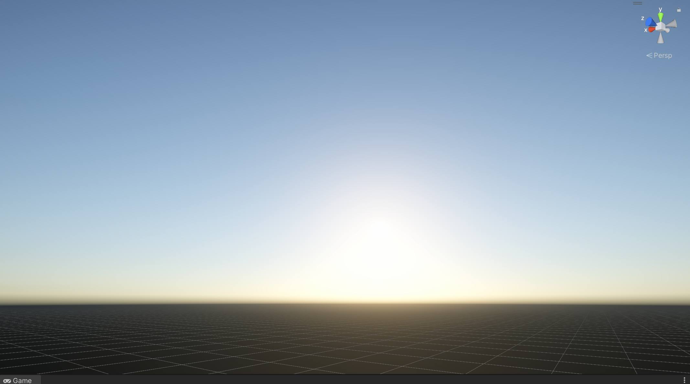
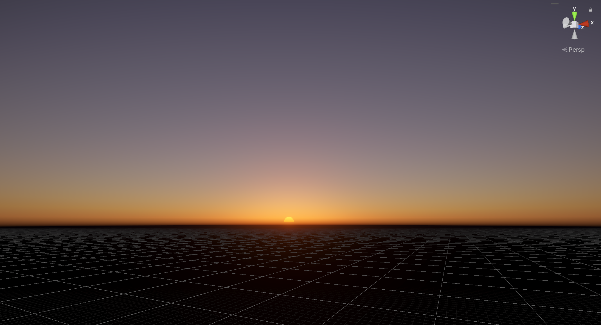

this is a easy atmosphere scattering implement in unity urp by using render feature

flow this article on zhihu : [实时大气散射渲染实战](https://zhuanlan.zhihu.com/p/595576594)

how to use this repo : 
1. create a new **urp 3d** project 
2. Edit -> project settings -> graphics -> scriptable render pipeline settings, choose a pipeline setting 

3. copy the scripts and shaders/hlsl files into the project , add a render feature in universal renderer data. 

4. create material with four shader (Transmiitancelut, multiscatteringlut, skyview, skybox). create the atmosphereSettings in the right click menu.
5. drag material into the render feature on the inspector
6. Window -> Rendering -> Lighting ->Environment .Replace the skybox with the new skybox material. replace sun source using directional light in  default scene .

